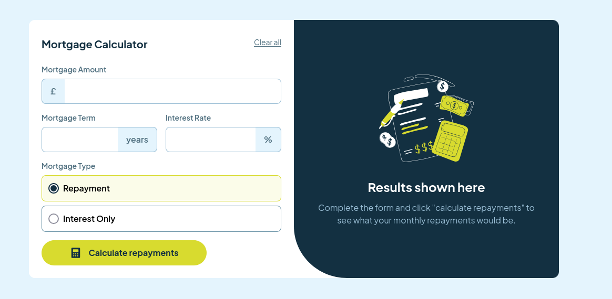

# Frontend Mentor - Mortgage repayment calculator solution

This is a solution to the [Mortgage repayment calculator challenge on Frontend Mentor](https://www.frontendmentor.io/challenges/mortgage-repayment-calculator-Galx1LXK73). Frontend Mentor challenges help you improve your coding skills by building realistic projects. 

## Table of contents

- [Overview](#overview)
  - [The challenge](#the-challenge)
  - [Screenshot](#screenshot)
  - [Links](#links)
- [My process](#my-process)
  - [Built with](#built-with)
  - [What I learned](#what-i-learned)
  - [Continued development](#continued-development)
- [Author](#author)

## Overview

### The challenge

Users should be able to:

- Input mortgage information and see monthly repayment and total repayment amounts after submitting the form
- See form validation messages if any field is incomplete
- Complete the form only using their keyboard
- View the optimal layout for the interface depending on their device's screen size
- See hover and focus states for all interactive elements on the page

### Screenshot

### Links

- Solution URL: [Add solution URL here](https://github.com/jambanix/frontendmentor_mortgage-repayment-calculator)
- Live Site URL: [Add live site URL here](https://jambanix.github.io/frontendmentor_mortgage-repayment-calculator/)

## My process

### Built with

- [React](https://reactjs.org/) - JS library
- [TailwindCSS](https://tailwindcss.com/) - TailwindCSS
- [react-hook-form](https://react-hook-form.com/) - React Hook Form

### What I learned

This was my first time using react-hook-form. On my first attempt at this challenge, I had created components with use of state and refs to create a dynamic form, and everything worked apart from the clear functionality. I done some research on the standard ways developers tackle forms in React and react-hook-form seemed to be the standard. I spent a bit of time reading the documentation and applied it to this challenge, and could see immediately why react-hook-form is an industry standard - it took a lot of the work out and was simple to use.

### Continued development

As always, I will keep doing these challenges alongside the Udemy courses I am following to reinforce my learning and further develop my skills.

## Author

- Frontend Mentor - [@jambanix](https://www.frontendmentor.io/profile/jambanix)
- Github - [jambanix](https://github.com/jambanix)

